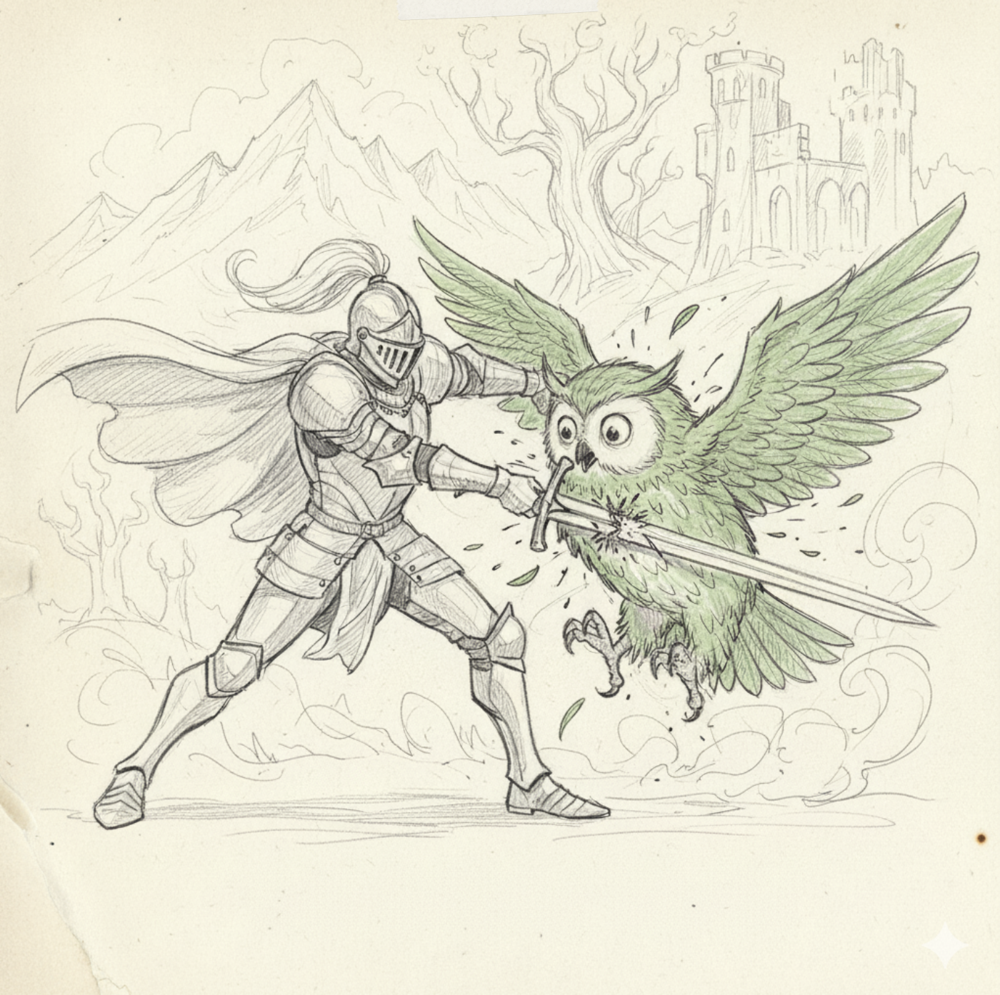
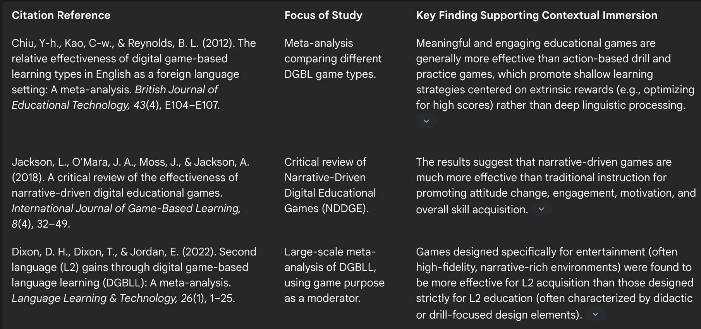

# Role-Playing Language Learning Game (RPLLG)
Learn languages by playing an immersive, interactive adventure! Powered by generative AI.

Research shows that language learning is improved by being immersed in a story / interactive game when compared to short, one-off puzzles.

LLMs allow open-ended, interactive story progression with player input. The goal is to build the lore to be centered around the concept of 2 languages, reflected in the gameplay.
A fantasy example, using parallel dimensions (overused concept, I know): 
- Player's reality speaks the known language
- Alternate reality creates tears in the narrative itself, meaning that the story will be corrupted, exchanging some words with foreign language
- The "dungeon encounters" require the player to restore the exchanged words to the original language, restoring the narrative and closing the tear.
- As the world state progresses, tears corrupt a higher percentage of the narrative per encounter, naturally scaling the difficulty. At max difficulty (endgame) entire paragraphs need to be translated back. 
- Encounters are the atomic units of gameplay (5-10 minutes), and can go both ways of translation direction
- If the player chooses the mage class, the "spells" are the act of translating. Attack / defense moves could be determined by direction of translation (foreign -> known vs known -> foreign)
- Player levels up by completing encounters, special moves etc can be unlocked.

This is an ambitious project, especially if LLMs have to be tied to a persistent world and character state. The goal of a prototype project can be a proof-of-concept, focusing on one aspect of the game.
**Research Question**: Comparing language acquisition between control group and test group on various language learning metrics. 
**Hypothesis**: RPLLG represents an effective implementation of results from the literature:

In this case, drill and practice games represent control group (Duolingo users), whereas RPLLG are the test group.
